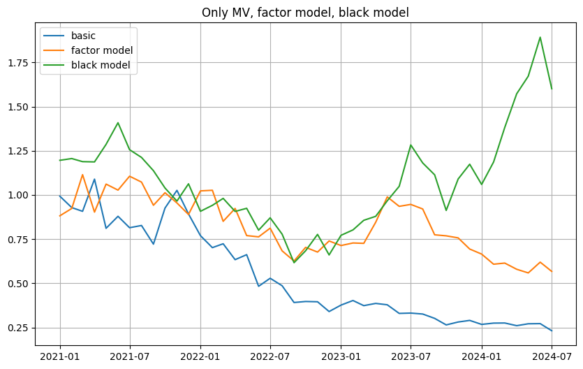

# GNN(Masked Language Model)을 활용한 테마 분산투자 (Done)
---

## 목차 (Table of Contents)

1. [프로젝트 소개 (Introduction)](#프로젝트-소개-introduction)  
2. [프로젝트 핵심 (Point)](#분석-개요-overview)  
3. [프로젝트 구조 (Project-Structure)](#프로젝트-구조-project-structure)  


---

## 프로젝트 소개 (Introduction)

- **목적**: 감성분석한 결과를 최적화 모델에 직접적으로 사용해보자
- **선행 연구의 한계**:
  - 대부분의 연구에서 감성분석 결과를 통해 투자를 진행할 때 동일 가중 포트폴리오를 만든다. 이러한 방법보다 더욱 정밀한 방법은 없을까?

- **가설**:
  - 감성점수를 통해 팩터모델링을 진행해 Black Litterman 모델에 넣어 예측값을 투자자의 뷰 p-value를 확신정도로 모델링이 가능할 것이다. 

---

## 프로젝트 핵심 (Point)
###  1. 문장단위의 감성분석
- 기존 감성분석은 긍/부/중립 형태로 최대 세가지로 분류하였다. 이러게 분류된 값은 다른 모델에 활용하기 어려웠고 문서의 내용을 과도하게 압축할 수 있다는 문제가 존재한다.

  그렇기에 문서의 문장마다 긍부정을 판단해 해당 문서에서 긍부정 비율을 산출 가능하며 이는 단순 분류 값보다 다양하게 활용가능하다
### 2. Black litterman모델
- 기존 MV(Mean-Varinace)모델에서 발전된 Black litterman모델은 투자자의 뷰를 넣을 수 있다는 장점이 있지만 이러한 뷰를 모델링하기 쉽지 않다.
- 해당 투자자의 뷰를 애널리스트 리포트 감성점수를 활용해 모델링을 진행하여 빠르고 설명력 높은 모델을 만들 수 있었다. 


---

## 프로젝트 구조 (Project structure)

## 프로세스 개요

1. **네이버 애널리스트 리포트 크롤링**  
   - 인터넷 상의 애널리스트 보고서를 수집하는 단계

2. **텍스트 변환**  
   - 수집한 데이터를 텍스트 형태로 전처리(HTML 태그 제거, 인코딩 통일 등)

3. **언어모델 감성분석**  
   - 전처리된 텍스트 데이터를 LLM 기반 감성분석 모델에 입력해 긍정·부정 스코어를 산출

4. **Factor Modeling (FF-3 모델 확장)**  
   - 기존 Fama-French 3 Factor 모델에 감성 점수를 추가 팩터로 활용

5. **Black-Litterman 모델 구축**  
   - Factor 모델의 예측값과 p-value를 기반으로 투자자의 견해(뷰)와 불확실성을 반영하여 최적화 포트폴리오 구성

6. **모델 성과 확인**  
   - Backtest, 성과지표(Sharpe, MDD 등)로 결과 평가
   


---

```mermaid
flowchart LR
    A([네이버 애널리스트 리포트<br>크롤링]) --> B([텍스트 전처리])
    B --> C([언어모델<br>감성분석])
    C --> D([감성 점수 + FF-3 모델<br>Factor Modeling])
    D --> E([Black-Litterman 모델 구축])
    E --> F([성과 평가<br>및 결과 확인])


